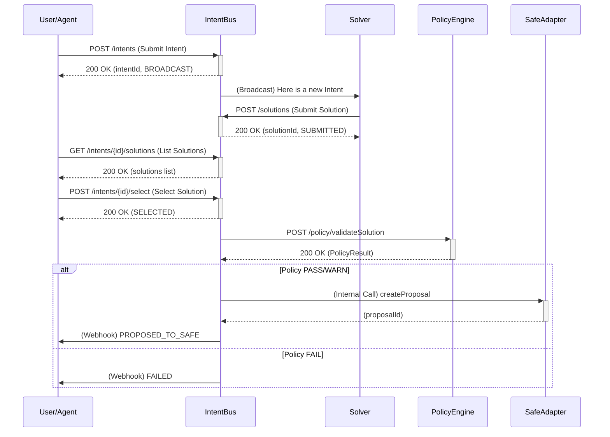

# HIEF Intent Bus API 规范 (v0.1)

本文档定义了 HIEF Intent Bus 的核心 API 接口，为 AI Agent、前端、Solver 提供统一的交互入口。所有接口都应遵循 OpenAPI 3.1 规范（见 `api/hief-mvp.openapi.yaml`）。

## 1. 核心实体与流程

## 2. API 端点

### 2.1 `/intents`

- **`POST /intents`**: 提交一个新的 Intent。
    - **Body**: `Intent` 对象 (HIEF-INT-01)
    - **Response**: `{ intentId, intentHash, status: "BROADCAST" }`
    - **行为**: 校验 Intent 结构与签名，计算 `intentHash`，存入数据库，并广播给所有激活的 Solver。

### 2.2 `/intents/{intentId}`

- **`GET /intents/{intentId}`**: 获取 Intent 的详细信息和当前状态。
- **`POST /intents/{intentId}/cancel`**: 取消一个未执行的 Intent。

### 2.3 `/solutions`

- **`POST /solutions`**: Solver 推送一个 Solution（Push 模式）。
    - **Body**: `Solution` 对象 (HIEF-SOL-01)
    - **Response**: `{ solutionId, status: "SUBMITTED" }`

### 2.4 `/intents/{intentId}/solutions`

- **`GET /intents/{intentId}/solutions`**: 列出某个 Intent 收到的所有 Solutions，可按状态筛选。

### 2.5 `/intents/{intentId}/select`

- **`POST /intents/{intentId}/select`**: 用户选择一个 Solution 以进入执行流程。
    - **Body**: `{ solutionId }`
    - **行为**: 触发对该 Solution 的 `validateSolution` 调用。

### 2.6 `/intents/{intentId}/policy`

- **`GET /intents/{intentId}/policy`**: 获取指定 Solution（默认为已选中的）的 `PolicyResult`。

### 2.7 `/intents/{intentId}/proposals`

- **`POST /intents/{intentId}/proposals`**: （内部或高级用户使用）为一个已验证通过的 Solution 创建 Safe 提案。

## 3. 通用要求

- **认证**: 所有写操作（POST）都应通过某种认证机制（如 Bearer Token）来识别调用方（Agent 或 Solver）。
- **幂等性**: 所有 POST 请求都应支持 `Idempotency-Key` header，确保重试安全。
- **错误处理**: API 必须返回标准化的错误响应，包含 `errorCode` 和 `message`。
- **版本控制**: API 应通过 URL 进行版本控制（例如 `/v1/intents`）。

## 4. Webhooks (推荐)

为了提供更好的异步体验，Intent Bus 应该提供 Webhook 功能，在以下关键状态变更时通知客户端：

- Intent 状态变更 (e.g., `EXECUTED`, `FAILED`)
- Solution 被选中
- Policy 验证完成
- Proposal 创建成功
