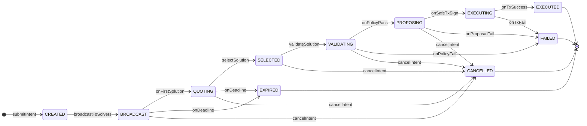
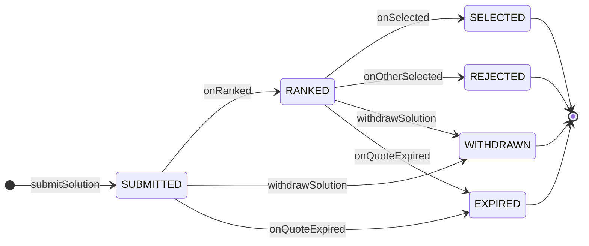
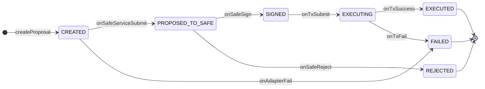

# HIEF 状态机规范 (v0.1)

本文档定义了 HIEF 系统中核心对象（Intent, Solution, Proposal）的状态流转，确保系统在任何时候都处于确定性状态，并能正确处理并发、超时与失败。

## 1. Intent 状态机

Intent 是整个流程的起点，其状态流转代表了用户意图从创建到最终执行的全过程。

### 1.1 状态图

### 1.2 状态定义与转换

| 状态 | 描述 | 触发转换 |
| :--- | :--- | :--- |
| `CREATED` | Intent 已提交，但未广播 | `submitIntent` 成功后 |
| `BROADCAST` | 已广播给 Solver，等待报价 | `broadcastToSolvers` 成功后 |
| `QUOTING` | 已收到至少一个 Solution | `onFirstSolution` 事件 |
| `SELECTED` | 用户已选择一个 Solution | `selectSolution` API 调用 |
| `VALIDATING` | Policy 引擎正在验证所选 Solution | `validateSolution` 异步任务触发 |
| `PROPOSING` | Policy 验证通过，正在创建 Safe 提案 | `onPolicyPass` 事件 |
| `EXECUTING` | Safe 提案已签名，交易已提交上链 | `onSafeTxSign` 事件 |
| `EXECUTED` | 交易成功上链并确认 | `onTxSuccess` 回调 |
| `FAILED` | 流程中任意环节失败 | `onPolicyFail`, `onProposalFail`, `onTxFail` |
| `EXPIRED` | 超过 `deadline` 未执行 | 定时任务触发 |
| `CANCELLED` | 用户主动取消 | `cancelIntent` API 调用 |

### 1.3 关键规则

- 只有处于 `BROADCAST`, `QUOTING`, `SELECTED`, `VALIDATING`, `PROPOSING` 状态的 Intent 才能被取消。
- 一旦进入终态（`EXECUTED`, `FAILED`, `EXPIRED`, `CANCELLED`），状态不可再变更。
- `deadline` 是全局约束，任何非终态在 `deadline` 到期后都应转为 `EXPIRED`。

## 2. Solution 状态机

Solution 的生命周期与 Intent 强绑定，代表了单个执行方案的竞价与筛选过程。

### 2.1 状态图

### 2.2 状态定义与转换

| 状态 | 描述 | 触发转换 |
| :--- | :--- | :--- |
| `SUBMITTED` | Solver 已提交 Solution | `submitSolution` 成功后 |
| `RANKED` | 已被 Intent Bus 纳入排序池 | 内部排序逻辑完成 |
| `SELECTED` | 被用户选中 | `selectSolution` API 调用 |
| `REJECTED` | 同一 Intent 的其他 Solution 被选中 | `onOtherSelected` 事件 |
| `WITHDRAWN` | Solver 主动撤回 | `withdrawSolution` API 调用（v0.2） |
| `EXPIRED` | 超过 `quote.validUntil` | 定时任务触发 |

## 3. Proposal 状态机

Proposal 代表了与 Safe Adapter 交互的最终执行阶段。

### 3.1 状态图

### 3.2 状态定义与转换

| 状态 | 描述 | 触发转换 |
| :--- | :--- | :--- |
| `CREATED` | 已调用 `createProposal` | API 调用成功 |
| `PROPOSED_TO_SAFE` | 已成功提交至 Safe Tx Service | Safe Adapter 回调 |
| `SIGNED` | Safe 签名达到阈值 | Safe 事件监听或轮询 |
| `EXECUTING` | 交易已广播至 mempool | Safe 事件监听或轮询 |
| `EXECUTED` | 交易成功上链 | `onTxSuccess` 回调 |
| `FAILED` | 创建、提交或执行失败 | 任意环节失败回调 |
| `REJECTED` | Safe 签名者拒绝提案 | Safe 事件监听 |
